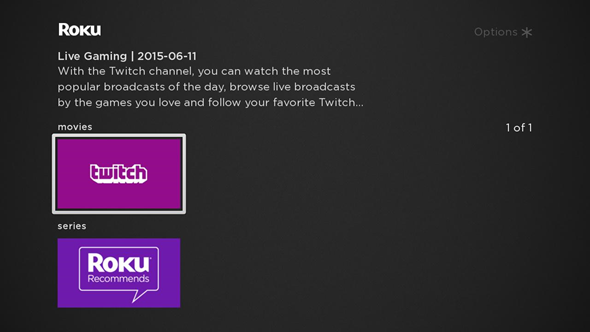
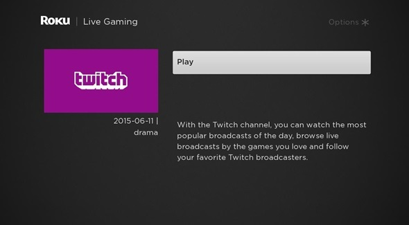
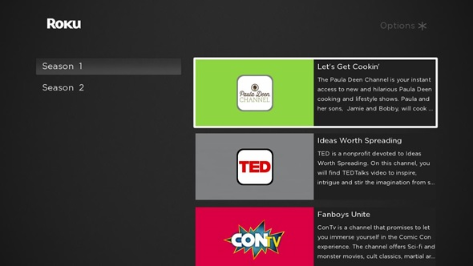

# SGDEX Sample: Basic Channel

## SGDEX Introduction

This sample will be using Scene Graph Developer Extensions (SGDEX) to streamline to process and make it quicker to build a good looking, custom app.
You can build a basic channel using the built-in tools like the one we do in this sample but you also have the power of Roku SceneGraph at your disposal.

Framework is composed of a few different components. They have the few basic views: a
grid view, a category list view, a details view, and a video view. These handle all
the logistics for displaying your content, and they each use a ContentHandler.
A ContentHandler is used to get and parse out the data you get from your own
content feed. To use these Components you extend them and then override the
functions in them to fit your channel.


## Step 1: Setting up the environment

If you’re new to Roku Development and you don’t have your environment set up, use the guide here [https://www.youtube.com/watch?v=-gq_5NRuHQ8](https://www.youtube.com/watch?v=-gq_5NRuHQ8) to set up your Roku and you can use Eclipse with the Brightscript plugin using this guide here[https://sdkdocs.roku.com/display/sdkdoc/Roku+Plugin+for+Eclipse+IDE](https://sdkdocs.roku.com/display/sdkdoc/Roku+Plugin+for+Eclipse+IDE).

If you are new to Brightcript an or Roku Scenegraph development please read through our documentation on it here [https://sdkdocs.roku.com/display/sdkdoc/BrightScript+Language+Reference](https://sdkdocs.roku.com/display/sdkdoc/BrightScript+Language+Reference) to learn the basics on the language.

## Step 2: Setting up SGDEX

First, you need to set up your file structure. It should look like this:

```
components/
    SGDEX/
    your RSG components
source/
    main.brs
    SGDEX.brs
manifest
```

After you have that all set up you should set up your manifest file. You can find out how here <https://sdkdocs.roku.com/display/sdkdoc/Roku+Channel+Manifest>.

Feel free to change the title and images to the fit your channel. You need to make sure you have the line below.

Now it is time to start coding your channel! We begin with the Main.brs file. You should override the function “GetSceneName()” to provide SGDEX with the name of your entry scene.It should look like this:

```
function GetSceneName() as String
    return "MainScene"
 end function
```

## Step 3: Setting up your SGDEX Components

Now that the SGDEX library knows where to go to initialize your SGDEX components, we can begin setting up the channel. Go to your MainScene and override the “show()” function. In this we first create a grid view object and set a few fields to fit our content.

```
m.grid = CreateObject("roSGNode", "GridView")
m.grid.setFields({
    style: "standard"
    posterShape: "16x9"
})
```

After this we create a ContentNode and add a content handler to it in order to get and parse the content, more on this later.

```
content = CreateObject("roSGNode", "ContentNode")
content.addfields({
    HandlerConfigGrid: {
        name: "RootHandler"
    }
})
```

We now add the ContentNode to the grid.

```
m.grid.content = content
```

Next we set up observers for what navigating the grid.

```
m.grid.ObserveField("rowItemSelected","OnGridItemSelected")
```

Finally, we display the grid.

```
m.top.ComponentController.callFunc("show", {
    view: m.grid
})
```

When the grid gets displayed, its content handler will be invoked. Now, let’s setup the content handler.

## Step 4: Parsing the Content

In your components folder create another folder titled “content”. Inside the folder create two files, named RootHandler.brs and RootHandler.xml. We will start with the xml. Content handler node should You are going to want extend ContentHandler. Set its script to RootHandler.brs. The final result should look like this

```
<?xml version="1.0" encoding="UTF-8"?>
    <component name="RootHandler" extends="ContentHandler">
    <script type="text/brightscript" uri="RootHandler.brs" />
</component>
```

Now onto RootHandler.brs. In this file you only need to override the GetContent() function of ContentHandler. In this you get the content from your feed url and parse it. To get the content from a feed url you do the following:

```
url = CreateObject("roUrlTransfer")
url.SetUrl("http://feed_path")
url.SetCertificatesFile("common:/certs/ca-bundle.crt")
url.AddHeader("X-Roku-Reserved-Dev-Id", "")
url.InitClientCertificates()
feed = url.GetToString()
```

Note: this is for a url using https. The Certificates are only needed if you use https, not http.

Note: In our sample we are using a static Json file. The next step will differ slightly if you are using a different format for your feed.

```
feed = ReadAsciiFile("pkg:/feed/feed.json")
sleep(2000)
```

Now it is our job to parse the data. In this sample we are dividing the content into two Categories: movies and series. Before we add the individual pieces of content to the data structure we set the following pieces of metadata:

- hdPosterUrl: A thumbnail
- Description: A short description of the content
- Categories: The genre of content

The result data structure should be passed to m.top.content Content node like:

```
m.top.content.appendChildren(rowsContentNodeArray)
```

At this point, once you side load your channel you should be greeted to a screen that looks like this



## Step 5: The Details View

Now we will implement choosing a piece of content and displaying the detail View. It is time to implement the function we mentioned when we set up the GridItemSelectedListener. The function header should look like this

```
sub OnGridItemSelected(event as Object)
```

In order to get the context of the event, you use the function GetRoSGNode() as in the following line:

```
grid = event.GetRoSGNode()
```

After that you get some other information about the function and then open the details View using the ShowDetailsView() function. We also need to establish an observer for if the user backs out of the Details View. The function should look like this in the end

```
sub OnGridItemSelected(event as Object)
    grid = event.GetRoSGNode()
    selectedIndex = event.getData()
    rowContent = grid.content.getChild(selectedIndex[0])
    detailsView = ShowDetailsView(rowContent, selectedIndex[1])
    detailsView.ObserveField("wasClosed", "OnDetailsWasClosed")
 end sub
```

And the OnDetailsWasClosed should can look like this, if you want Grid to be focused on last watched item after

```
sub OnDetailsWasClosed(event as Object)
    details = event.GetRoSGNode()
    m.grid.jumpToRowItem = [m.grid.rowItemFocused[0], details.itemFocused]
end sub
```

Now create the file “DetailsViewLogic.brs” under the components folder. First thing we do is implement the ShowDetailsView function we called in the previous function. The function header looks as such

```
function ShowDetailsView(content, index, isContentList = true)
```

We begin by creating an DetailsView and observing the content and buttonSelected Field.

```
details = CreateObject("roSGNode", "DetailsView")
details.ObserveField("content", "OnDetailsContentSet")
details.ObserveField("buttonSelected", "OnButtonSelected")
```

You then set the details fields to their respective function arguments.

```
details.content = content
details.jumpToItem = index
details.isContentList = isContentList
```

Setting the details.content will trigger the observer, so we should implement that now. In this View we need to contextually provide different information whether the content we selected is a series or a movie, so we check the event.getData.Title to see whether the title is series or not.

Go into details about the SceneGraph tree, seeing where we set the information in the getData call. Display in a UML tree.

The final function should look like this

```
sub OnDetailsContentSet(event as Object)
    if event.getData().TITLE = "series"
        m.btnsContent = Utils_ContentList2Node([{title:"Play S1:E1", id:"playFirstEp"}, {title:"Episodes", id:"episodes"}])
    else
        m.btnsContent = Utils_ContentList2Node([{title:"Play", id:"play"}])
    end if

    details = event.getRoSGNode()
    details.buttons = m.btnsContent
 end sub
```

Now let’s create the button observer. You get the context like you did before and get the content of the button in a similar way

```
sub OnButtonSelected(event as Object)
    details = event.GetRoSGNode()
    selectedButton = details.buttons.GetChild(event.GetData())
```

If the button’s id is “play” we open the video player and send the appropriate arguments to find the content data. Otherwise if the selected button is the “episodes” then you need to show the episode picker View.

```
if selectedButton.id = "play"
    OpenVideoPlayer(details.content, details.itemFocused, details.isContentList)
else if selectedButton.id = "episodes"
    ShowEpisodePickerView(details.currentItem.seasons)
end if
```

Going back to the ShowDetailsView() function, we show the details View and return the object.

```
m.top.ComponentController.callFunc("show", {
    view: details
})
return details
```

At this point (Assuming no compiler errors from functions we have not created yet), once you side load and you select an item, you should be greeted with this View



Next, we move onto the VideoPlayer logic. Later, we will move onto the EpisodePicker logic

## Step 6: Video Player Logic

We first implement the function we call in the previous file, OpenVideoPlayer. The header looks like this

```
function OpenVideoPlayer(content, index, isContentList) as Object
```

We create a VideoView object and add the arguments to it.

```
video = CreateObject("roSGNode", "VideoView")
video.content = content
video.jumpToItem = index
video.isContentList = isContentList
```

Next we set the video.control to “play” and finally show the video view object then return it.

```
m.top.ComponentController.callFunc("show", {
    view: video
})
return video
```

The only other function we will add is addressing the event where the video is exited mid playback. The content should be cleared in order to stop playback without issues on re-buffering.

```
sub OnVideoWasClosed(event as Object)
    video = event.getRoSGNode()
    if video <> invalid then
        video.content = invalid
    end if
 end sub
```

## Step 7: EpisodePicker Logic

We start by implementing the ShowEpisodePickerView(seasonContent) function that we call in the details View logic. We begin by creating an CategoryListView object and set the posterShape to be square.

```
episodePicker = CreateObject("roSGNode", "CategoryListView")
episodePicker.posterShape = "square"
```

We then create a content node and add a content handler to it to get the seasons in a format that content the CategoryListView likes. To do this we do an additional thing, send down the “seasonContent” object as a parameter.

```
content = CreateObject("roSGNode", "ContentNode")
content.addfields({
    HandlerConfigCategoryList: {
        name: "SeasonsHandler"
        seasons: seasonContent
    }
})
```

To access these Content Handlers we must create two files, SeasonsHandler.brs and SeasonsHandler.xml. Your xml should look like this

```
<?xml version="1.0" encoding="UTF-8"?>
<component name="SeasonsHandler" extends="ContentHandler">
    <script type="text/brightscript" uri="SeasonsHandler.brs" />
    <interface>
        <field id="seasons" type="array" />
    </interface>
</component>
```

Notice how we include the interface which includes the seasons array. This is where we will get the content rather than accessing an api like we did in RootHandler. Moving onto the SeasonsHandler.brs you have to override the GetContent() function. We get the seasons through the line

```
seasons = m.top.HandlerConfig.Lookup("seasons")
```

We then go through and parse it similarly to before.

```
sub GetContent()
    seasons = m.top.HandlerConfig.Lookup("seasons")
    rootChildren = []
    for each season in seasons
        children = []
        for each episode in season
            children.Push(episode)
        end for
        seasonNode = CreateObject("roSGNode", "ContentNode")
        seasonNode.SetFields({
            Fix Before publishing
            title: "this is a title" 'season.Lookup("title")
            contentType : "section" 'season.Lookup("genre")
        })
        seasonNode.AppendChildren(children)

        rootChildren.Push(seasonNode)
    end for
    m.top.content.AppendChildren(rootChildren)
 end sub
```

Moving back to our EpisodePickerLogic we add the content to the episodePicker object, observe the selectedItem field to handle when an item is chosen.

```
episodePicker.content = content
m.top.ComponentController.callFunc("show", {
    view: episodePicker
})
```

This function look like such

```
sub OnEpisodeSelected(event as Object)
    'show details view with selected episode content
    categoryList = event.GetRoSGNode()
    itemSelected = event.GetData()
    category = categoryList.content.GetChild(itemSelected[0])

    ShowDetailsView(category.GetChild(itemSelected[1]), 0, false)
 end sub
```

This launches the Details View for the piece of content that you would like to play.

Finally back in the ShowEpisodePickerView(seasonContent) we show the View and return it'this will trigger job to show this View

```
m.top.ComponentController.callFunc("show", {
    view: episodePicker
})
return episodePicker
```

And finally the Episode Picker View should look like this



And there we go! We now have a channel that can take a feed in the style of direct publisher and stream the content.

###### Copyright (c) 2018 Roku, Inc. All rights reserved.
