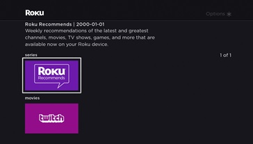

# SGDEX Guide: Grid

## Step 1: Initializing the Grid

To begin, start with the sample in [1_Setup+and+HelloWorld](../1_Setup+and+HelloWorld). Now go to your MainScene.brs file, in there we're going to fill out the show() function. First we create the GridView Object and set a few of its attributes

```
m.grid = CreateObject("roSGNode", "GridView")

m.grid.setFields({
    style: "standard"
    posterShape: "16x9"
})
```

Next we need to set up the Content Handler to fetch your content. To do this we need to create a content node and then tell it where the ContentHandler is.

```
content = CreateObject("roSGNode", "ContentNode")
content.addfields({
    HandlerConfigGrid: {
        name: "GridHandler"
    }
})
```

Next we need to set that content node we just made to our grid. After that, we will call the show() function to show our grid to the View. This is a main benefit of SGDEX, it does much of the groundwork for you regarding organizing and setting up the View.

```
m.grid.content = content
m.top.ComponentController.callFunc("show", {
    view: m.grid
})
```

A few things to note: We save the grid in m.grid so we can access it in other functions in the scene, we will be using this in later guides. Also, the content handler you set (in this case "GridHandler") will be invoked by SGDEX when the grid view is shown.

## Step 2: Fetching the Content

In your content folder, create two files, GridHandler.brs and GridHandler.xml.

These are the content handler we referenced earlier. Your GridHandler.xml should extend ContentHandler and point to GridHandler.brs. Also note: we are using several utility functions that we store in /source/rsg_utils.brs. The file is provided along with the finished channel at the end of this guide.

```
<?xml version="1.0" encoding="UTF-8"?>
<component name="GridHandler" extends="ContentHandler">
    <script type="text/brightscript" uri="pkg:/components/content/GridHandler.brs" />
</component>
```

Now onto the GridHandler.brs file, this will most likely differ for you since you probably have your content feed in a different format than us. Our content feed is in JSON format.

Either way, you need to perform a roURLTransfer. Ours is https, so we need to do additional steps that you may not need to do if yours is http.

```
url = CreateObject("roUrlTransfer")
url.SetUrl("FEED_URL")
url.SetCertificatesFile("common:/certs/ca-bundle.crt")
url.AddHeader("X-Roku-Reserved-Dev-Id", "")
url.InitClientCertificates()
```

After that you need to parse through the feed yourself. For this feel free to look through the full code provided below. A few things to note, you should have an array of content nodes, with each node representing a row on the grid. Each row has some number of child nodes, each of those nodes represent a poster on the grid that you can select and navigate to another View. Another thing to consider, before we add the individual pieces of content to the data structure we set the following pieces of metadata:

- hdPosterUrl: A thumbnail
- Description: A short description of the content
- Categories: The genre of content

Once you have parsed the feed and built a tree of content nodes, you should append the array of row nodes to the content node associated with your Content Handler like this:

```
m.top.content.appendChildren(rowsContentNodeArray)
```

After that, if you've parsed everything correctly you should be greeted to this View when you side load your channel.



###### Copyright (c) 2018 Roku, Inc. All rights reserved.
